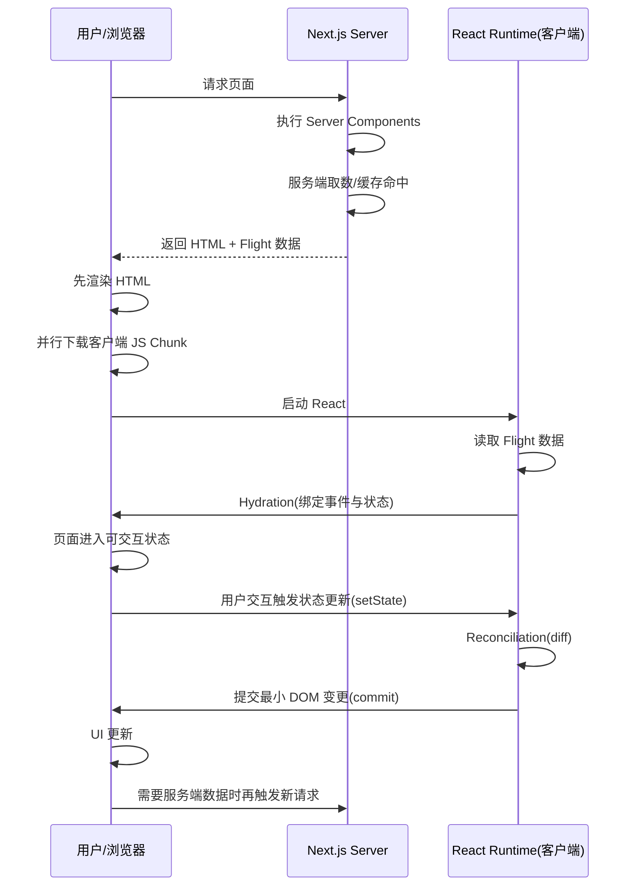

# RSC 数据流是什么？（含全流程图）

## 代码示例

```tsx
// app/page.tsx (Server Component)
import Counter from "./Counter";

async function getProducts() {
  const res = await fetch("https://api.example.com/products", {
    next: { revalidate: 60 },
  });
  return res.json();
}

export default async function Page() {
  const products = await getProducts();
  return (
    <main>
      <h1>RSC Demo</h1>
      <ul>
        {products.map((p: { id: string; name: string }) => (
          <li key={p.id}>{p.name}</li>
        ))}
      </ul>
      <Counter />
    </main>
  );
}
```

```tsx
// app/Counter.tsx (Client Component)
"use client";
import { useState } from "react";

export default function Counter() {
  const [count, setCount] = useState(0);
  return <button onClick={() => setCount((v) => v + 1)}>count: {count}</button>;
}
```

### 补充示例：HTML 字符串到真实 DOM 再到 Hydration

```ts
// 服务器返回给浏览器的是 HTML 字符串（不是 DOM 对象）
const html = `
<!doctype html>
<html>
  <body>
    <div id="root"><h1>Hello SSR</h1></div>
    <script src="/client.js"></script>
  </body>
</html>
`;

return new Response(html, {
  headers: { "Content-Type": "text/html; charset=utf-8" },
});
```
```ts
浏览器收到后会做两件事：
1. 把 HTML 字符串解析成真实 DOM
2. 执行 client.js，接管 hydration
```


```ts 
然后 React 在客户端“接管” hydration，把 HTML 字符串解析出来的 DOM 转换成 React 组件树，并挂载到真实 DOM 上。
更准确说法是：

Hydration 阶段不是“常规更新场景下的虚拟 DOM diff”。
它是在已有服务端 DOM上做“匹配 + 绑定事件 + 建立 Fiber”。
如果发现不一致（mismatch），React 才会在局部做修正，严重时回退为客户端重建该子树。
所以可以改成这句（建议放题库）：

React 在客户端进行 hydration 时，会尝试将客户端组件树与服务端已生成的 DOM 进行匹配并接管（绑定事件、恢复状态）。这不是普通更新阶段的 diff；只有发生不一致时才会触发局部修正或重建。
## 补充：SSR 和 RSC 的区别

SSR（Server-Side Rendering）是 React 16 引入的，它是在服务器端生成 HTML，然后发送给客户端，客户端只需要解析 HTML 就可以渲染页面。  
RSC（React Server Components）是 Next.js 13 引入的，它是在服务器端生成 React 组件，然后发送给客户端，客户端只需要解析组件就可以渲染页面。  
RSC 的优点是：  
1. 可以在服务器端进行更复杂的计算，比如数据库查询、API 调用等，然后将结果直接传递给客户端。这样可以减少客户端的计算量，提高性能。
2. 可以在服务器端进行更复杂的渲染，比如动态生成页面结构、动态加载组件等，然后将结果直接传递给客户端。这样可以减少客户端的渲染量，提高性能。
3. 可以在服务器端进行更复杂的错误处理，比如捕获异常、重试请求等，然后将结果直接传递给客户端。这样可以减少客户端的错误处理量，提高可靠性。
## 补充：RSC 的数据流

RSC 的数据流可以理解为：  
**服务端算结构 + 客户端做交互**

不是二选一，Next.js 16 同时支持 SSR 和 RSC，而且默认是“混合架构”。

可以这么记：

RSC：App Router 下的默认组件模型（不写 "use client" 的组件就是 Server Component）
SSR：一种渲染时机策略（请求时在服务端生成 HTML）
SSG/ISR：另外两种渲染时机策略
所以在 Next.js 16 里常见是：

用 RSC 组织组件边界（哪些在服务端跑，哪些在客户端跑）
同时按页面需求选择 SSR/SSG/ISR 的生成策略
一句话：
Next.js 16 = 组件层面偏 RSC，渲染策略层面可 SSR/SSG/ISR 并存。

```
然后 React 在客户端“接管” hydration，把 HTML 字符串解析出来的 DOM 转换成 React 组件树，并挂载到真实 DOM 上。
```tsx
// client.tsx
import { hydrateRoot } from "react-dom/client";
import App from "./App";

// 不是重新创建整页，而是在已有 DOM 上 hydrate
hydrateRoot(document.getElementById("root")!, <App />);
```

## 原理讲解

RSC（React Server Components）数据流可以理解为：  
**服务端算结构 + 客户端做交互**。

先澄清一个常见误区：  
**服务端当然也在“跑 React 组件”**，只是跑的是 Server Components 渲染流程；浏览器端主要负责 Client Components 的交互与后续更新。

关键点：

- 服务端先执行 Server Components，拿数据并生成可序列化的组件树信息（Flight 数据）和 HTML。
- 浏览器先展示 HTML（提升首屏可见速度）。
- 客户端下载 JS 后，React 根据 Flight 数据恢复组件边界，并对 Client Components 做 hydration 绑定。
- 后续客户端交互仍走 React 正常更新流程（虚拟 DOM/reconciliation）。

### RSC 时序图（推荐）



### RSC 泳道图（文字版）

```txt
浏览器/用户            | Next.js Server                 | React(客户端)
---------------------------------------------------------------------------
发起请求               |                                |
                      | 执行 Server Components(React 在服务端渲染) |
                      | 服务端取数/缓存命中             |
接收 HTML + Flight    |                                |
先展示 HTML            |                                |
并行下载 JS Chunk      |                                |
                      |                                | 启动并读取 Flight
                      |                                | Hydration 绑定事件/状态
页面可交互             |                                |
用户交互(setState)     |                                | diff/reconcile -> commit
UI 局部更新            |                                |
后续交互               | 可能触发新请求                 |
```

### “RSC 数据流”里有哪些关键产物？

1. **HTML**：用于首屏快速展示。  
2. **Flight 数据**：描述服务端组件树和边界信息，不等于把虚拟 DOM 原样传输。  
3. **客户端 JS**：只给需要交互的 Client Components。  
4. **真实 DOM（浏览器内）**：由浏览器解析 HTML 后在内存中构建，React 在其上完成 hydration。

## 练习

### 练习 1（基础）

为什么说 RSC 能减少客户端 JS 体积？

### 练习 1 参考答案

因为 Server Components 逻辑在服务端执行，不需要把其组件运行时代码整体下发到浏览器；客户端只下载交互组件相关 JS。

### 练习 2（进阶）

如果一个列表页首屏很快但交互按钮点不动，可能是哪一步有问题？

### 练习 2 参考答案

- HTML 已返回，所以首屏能看到；  
- 但客户端 JS 未下载完成、执行失败，或 hydration 出错，会导致交互未接管。  
- 需要检查网络 chunk、控制台 hydration 报错、`use client` 边界。

## 高频追问

### Flight 是什么？下载的 JS Chunk 又是什么？

- **Flight**：RSC 协议数据，可理解为“服务端组件树的描述数据包”。它告诉客户端 React 组件边界、插槽位置、模块引用线索等，用于恢复和拼装 UI。
- **JS Chunk**：构建产物拆分后的客户端代码分片，包含 React runtime、路由代码、Client Components 代码和共享依赖。

两者关系：  
Flight 提供“描述信息”，JS Chunk 提供“可执行代码”，二者配合完成 hydration。

### Flight 是不是类似客户端组件的 AST 树？

不准确。**更接近“运行时协议载荷（wire format）”，不是编译期 AST**。

- AST 是编译器阶段的语法树，主要用于代码转换。
- Flight 是 React/Next 在运行时传输给客户端的数据协议，用于还原组件边界和渲染结果引用。

可以这样记：  
**AST 解决“怎么编译代码”，Flight 解决“怎么把服务端组件结果传给客户端拼装”。**

### RSC 数据流是不是“把虚拟 DOM 从服务端传给客户端”？

不是。传输的是 HTML + Flight 协议数据（可序列化组件信息），不是浏览器可直接运行的“虚拟 DOM 对象”。

### RSC 和 SSR 有什么关系？

可以认为 RSC 是 SSR 时代的组件级能力增强：SSR 解决首屏 HTML，RSC 进一步把更多组件逻辑留在服务端，减少客户端负担。

### RSC 会不会完全替代 CSR？

不会。交互密集区域仍需要 Client Components；实际是 Server + Client 混合架构。

## 面试口述模板

RSC 数据流的核心是“服务端算结构，客户端做交互”。请求进来后，Next.js 在服务端执行 Server Components，产出 HTML 和 Flight 数据，浏览器先显示 HTML，再下载客户端 JS 完成 hydration。这样首屏更快、客户端 JS 更少，但交互组件仍由 Client Components 承担。
